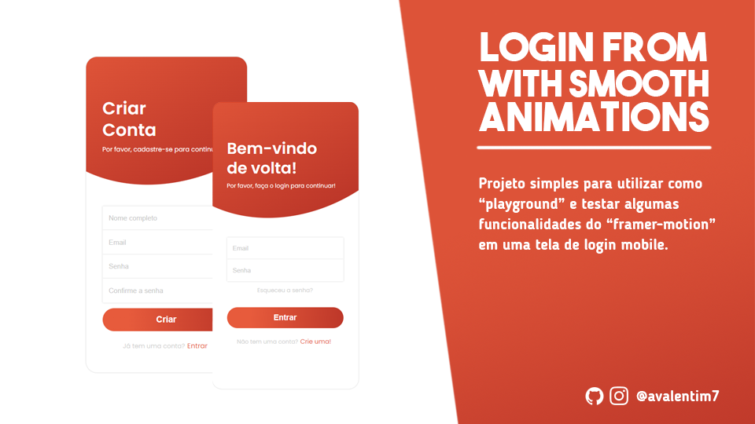

# Login Form with smooth animations



### Sobre o projeto

Um projeto básico de uma tela de login (mobile), para testar um pouco as funcionalidades do Framer Motion.

## ☕ Usando <login-form-smooth-animations>

Para usar <login-form-smooth-animations>, siga estas etapas:

```
npm run start
```